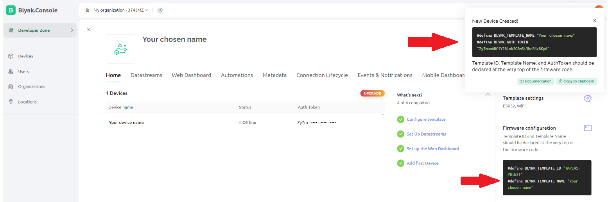
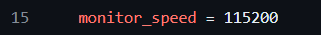

# floor_light

Floor light project is compatible with the Blynk app controlling the colours of the leds.

Blynk

Blynk is not an off-the-shelf application, but the basic version allows you to create a simple application that controls the colours of all the leds. \
Unfortunately the finished version of the application cannot be made available, it is most likely available for the PRO version. \
Below are the steps in preparing such an application.

1 - Create an account on the Blynk website -> https://blynk.cloud/dashboard/register \
2 - Follow the steps given in the emails from Blynk \
3 - If there are problems with creating a new template, follow the next steps in this short tutorial.

a - Create new Template  \
  \

b.1 - Setup 3 datastreams for rgb colors \
 \
b.2 - Chose Virtual Pin option \
b.3 - Chose Pins like V1, V2, V3  \
 \
b.4 - Set max value to 255

c.1 - Add device \
 \
c.2 - Set a name (can be same name as the name of template) \
 \
c.3 - You will get your template name, auth token, template id \

Once you have completed the above steps, you can move on to building the app on your phone. \
The final version of app should look like this \
 \

To achieve this design follow screenshots below. \
Make sure that Gauges and Sliders are connected to good datastream!

a - Gauges  \
  \
 \
 \
b - Colors of Guages \
 \
c - Sliders \
 \
 \

After app is complition of mobile app you should be ready to start to freely change colors when ESP32 is connected to power.

C++ code

Explanation of variables are in comments in code.

What to look out for!

When increasing the number of leds per 1 panel, remember to change the value of NUM_LEDS_PER_PANEL to match. \

In order to allow the panel to connect to the Wifi, you must provide the relevant data in the ssid and pass variables. \

The pins for the leds can be found in the LED_PINS list. \
 \
PINS : [P4, P0, P2, P15]

The pins for the sensors are located in a 2-dimensional array, they are already divided for each panel. \
 \
PINS : [{P33, P34, P35, P32}, {P25, P26, P27, P14}, {P12, P23, P22, P1}, {P21, P19, P18, P5}]

Remember to change values of your template id, template name and auth token \
 \
Keep these variables at the top of your code, otherwise you may encounter an error.

Remember to match Serial.begin(xxx) as it is in ini file, otherwise you code will not work. \
    - code \
   \
    - ini file \

There may be some sort of lag / bug with setting colors of rgb - if you encounter it, reset rgb to (0,0,0) using app and then set your chosen color, it should fix it.

Libraries

Libraries have been used in the code: \
    - fastled/FastLED@^3.6.0 - FastLED by Daniel Garcia \
    -arkhipenko/TaskScheduler@^3.7.0 - TaskScheduler by Anatoli Arkhipenko \
    - blynkkk/Blynk@^1.3.2 - Blynk by Volodymyr Shymanskyy \
 - ini file